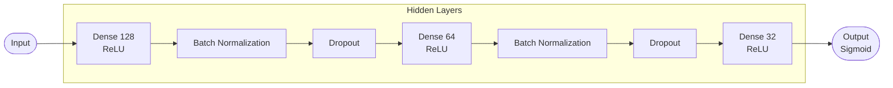
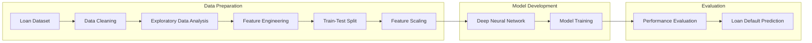

# 💳 Lending Club Loan Default Prediction

A machine learning and deep learning project that predicts whether a borrower is likely to default on a loan using historical **Lending Club** loan data. The project demonstrates an end-to-end data science workflow, including data preprocessing, exploratory data analysis (EDA), feature engineering, model development, and performance evaluation using a Deep Neural Network (DNN).

---

## 📌 Project Overview

Financial institutions face significant risks when issuing loans. Accurately predicting loan defaults enables lenders to minimize losses, improve credit risk assessment, and make informed lending decisions.

This project develops a **binary classification model** to predict loan default using borrower financial and credit information.

- **Problem Type:** Binary Classification
- **Dataset:** Lending Club Loan Data
- **Target Variable:** `not.fully.paid`
  - **0** → Loan Fully Paid
  - **1** → Loan Defaulted

---

# 🎯 Objectives

- Predict whether a borrower will default on a loan.
- Explore factors influencing loan repayment.
- Handle class imbalance effectively.
- Build a robust Deep Neural Network using TensorFlow.
- Evaluate model performance using multiple classification metrics.
- Identify the most influential features affecting loan default.

---

# 📊 Dataset Information

The project uses the **Lending Club Loan Dataset**, containing approximately **9,578 loan records** issued between **2007 and 2015**.

### Dataset Characteristics

| Attribute | Description |
|------------|-------------|
| Records | 9,578 |
| Problem Type | Binary Classification |
| Target Variable | `not.fully.paid` |
| Loan Status | Fully Paid / Defaulted |
| Features | Credit Score, Interest Rate, Income, DTI, Credit History, Loan Purpose, etc. |

---

# 🛠️ Tech Stack

### Programming Language

- Python 3

### Data Analysis

- Pandas
- NumPy

### Machine Learning

- Scikit-learn

### Deep Learning

- TensorFlow
- Keras

### Data Visualization

- Matplotlib
- Seaborn

---

# 📂 Project Workflow

## 1️⃣ Data Preprocessing

The dataset was cleaned and prepared before model training.

### Tasks Performed

- Loaded and inspected the dataset
- Checked for missing values
- Removed unnecessary features
- Encoded categorical variables using One-Hot Encoding
- Prepared numerical and categorical features
- Split the dataset into training, validation, and testing datasets

---

## 2️⃣ Exploratory Data Analysis (EDA)

EDA was performed to understand borrower characteristics and identify factors associated with loan defaults.

### Visualizations Included

- Loan Default Distribution
- FICO Score Distribution
- Interest Rate Analysis
- Debt-to-Income (DTI) Analysis
- Annual Income Distribution
- Credit Inquiry Analysis
- Loan Purpose Distribution
- Correlation Heatmap
- Feature Relationships

### Key Insights

- Borrowers with lower FICO scores were more likely to default.
- Higher interest rates were associated with increased default risk.
- Higher debt-to-income ratios generally increased the likelihood of default.
- Recent credit inquiries showed a moderate relationship with repayment behavior.

---

## 3️⃣ Feature Engineering

Feature engineering was applied to improve model performance and reduce multicollinearity.

### Techniques Used

- One-Hot Encoding
- Correlation Analysis
- Feature Selection
- Removal of Highly Correlated Features (`|r| > 0.75`)
- Feature Scaling using StandardScaler

---

## 4️⃣ Deep Learning Model

A Feed-Forward Deep Neural Network (DNN) was implemented using TensorFlow and Keras.

### Model Architecture




### Training Techniques

- Batch Normalization
- Dropout Regularization
- EarlyStopping
- ReduceLROnPlateau
- Binary Crossentropy Loss
- Adam Optimizer

---

# 📈 Model Evaluation

The trained model was evaluated using multiple classification metrics.

### Evaluation Metrics

- Accuracy
- Precision
- Recall
- F1-Score
- ROC-AUC Score
- Confusion Matrix
- Classification Report

### Threshold Optimization

Instead of using the default probability threshold (0.5), the classification threshold was optimized to maximize the **F1-score**, improving the model's ability to detect loan defaults.

---

# 🔍 Feature Importance

A permutation-based feature importance approach was used to determine which variables contributed most to loan default prediction.

### Key Influential Features

- FICO Score
- Interest Rate
- Debt-to-Income Ratio
- Annual Income
- Credit Utilization
- Revolving Balance
- Installment Amount
- Credit Inquiries
- Loan Purpose

---

# 📊 Machine Learning Pipeline



---

# 🚀 Getting Started

## Clone the Repository

```bash
git clone https://github.com/<your-username>/lending-club-loan-default-prediction.git

cd lending-club-loan-default-prediction
```


# 📁 Repository Structure

```text
lending-club-loan-default-prediction/


│── Lending_Club_Loan_Default_Prediction.ipynb
│── README.md

```

---

# 📌 Key Skills Demonstrated

- Data Cleaning
- Exploratory Data Analysis (EDA)
- Feature Engineering
- Data Visualization
- Binary Classification
- Deep Learning
- TensorFlow & Keras
- Model Evaluation
- Hyperparameter Optimization
- Credit Risk Modeling
- Financial Data Analysis

---

# 📈 Future Improvements

- XGBoost & LightGBM Comparison
- Hyperparameter Optimization using Optuna
- Explainable AI (SHAP & LIME)
- Class Imbalance Handling using SMOTE
- Model Deployment with FastAPI
- Interactive Dashboard using Streamlit
- MLflow Experiment Tracking

---

# 📫 Contact

**Arun Kumar**

📧 Email: arunkumarpremsai@gmail.com

💼 LinkedIn: https://linkedin.com/in/arunkumarpremsai

---

# ⭐ Support

If you found this project useful, consider giving the repository a **⭐ Star**.

Feedback, suggestions, and collaborations are always welcome!

---

> **"Applying machine learning to improve credit risk assessment and support data-driven lending decisions."**
````
